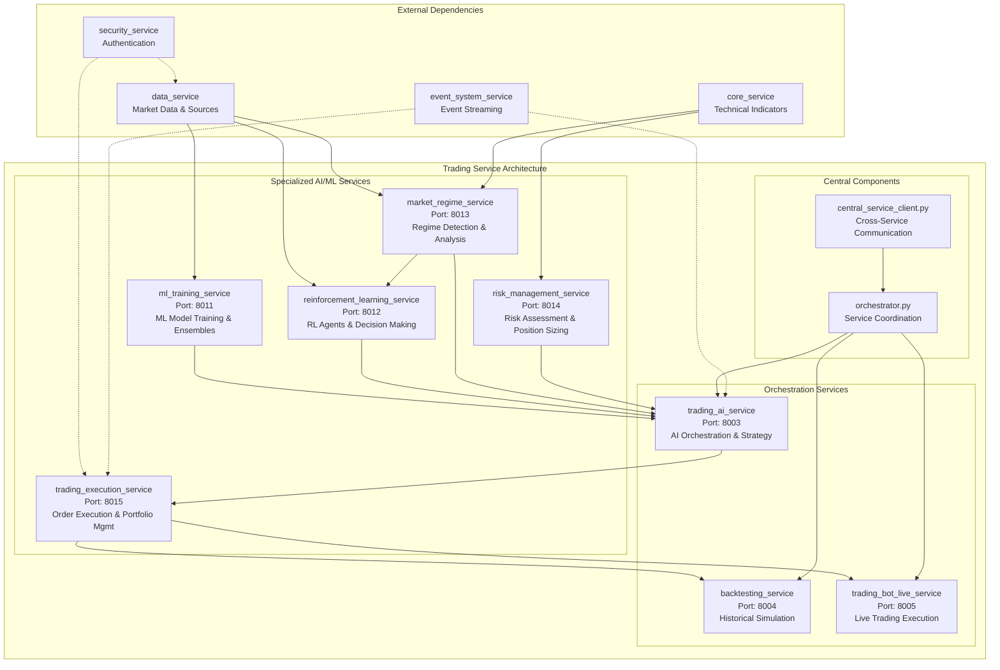
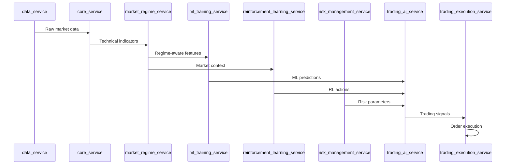
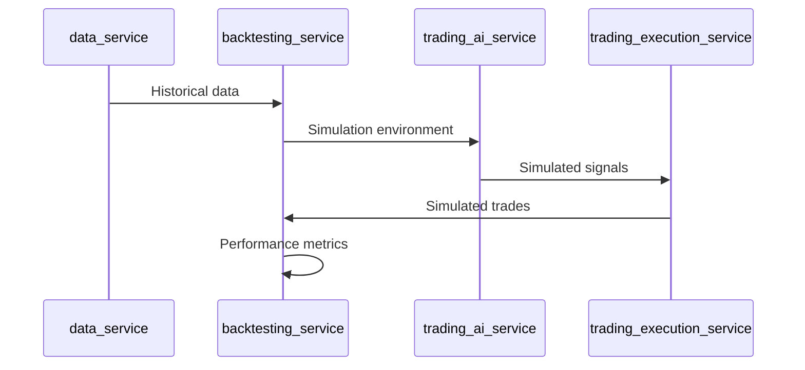

# TradPal Trading Service Architecture

## Overview
The trading_service is organized as a microservices architecture with specialized services for different trading functions.

## Service Architecture

### Core Trading Services

## Service Responsibilities

### Specialized AI/ML Services
1. **ml_training_service** (Port 8011)
   - ML model training and validation
   - Ensemble method implementation
   - Model performance optimization
   - Feature engineering and selection

2. **reinforcement_learning_service** (Port 8012)
   - Q-Learning and Deep RL agents
   - Trading environment simulation
   - Reward function design
   - Experience replay and training

3. **market_regime_service** (Port 8013)
   - Market regime classification
   - Volatility and trend analysis
   - Multi-timeframe pattern recognition
   - Regime transition detection

4. **risk_management_service** (Port 8014)
   - Position sizing calculations
   - VaR and risk metrics
   - Kelly criterion optimization
   - Portfolio risk assessment

5. **trading_execution_service** (Port 8015)
   - Order execution and management
   - Portfolio position tracking
   - Broker API integration (CCXT)
   - Transaction cost optimization

### Orchestration Services
6. **trading_ai_service** (Port 8003)
   - AI-powered trading orchestration
   - Signal generation and aggregation
   - Strategy execution coordination
   - Performance monitoring

7. **backtesting_service** (Port 8004)
   - Historical simulation engine
   - Performance metrics calculation
   - Walk-forward validation
   - Strategy optimization

8. **trading_bot_live_service** (Port 8005)
   - Live trading execution
   - Real-time position management
   - Risk monitoring and stops
   - Emergency shutdown procedures

## Data Flow Architecture

### Signal Generation Pipeline

### Backtesting Pipeline

## Service Communication Patterns

### Synchronous Communication
- REST API calls between services
- Health checks and status queries
- Configuration synchronization

### Asynchronous Communication
- Redis Streams for event-driven updates
- Market data updates
- Trading signal propagation
- Performance metrics publishing

### Service Dependencies
- **ml_training_service**: Independent (uses data_service)
- **reinforcement_learning_service**: Independent (uses market_regime_service)
- **market_regime_service**: Independent (uses core_service)
- **risk_management_service**: Independent (uses core_service)
- **trading_execution_service**: Depends on data_service, security_service
- **trading_ai_service**: Orchestrates all specialized services
- **backtesting_service**: Depends on all trading services
- **trading_bot_live_service**: Depends on all trading services

## Configuration Management
- Service URLs defined in `config/service_settings.py`
- Environment-specific configurations via `.env` files
- Dynamic service discovery through API Gateway
- Centralized logging and monitoring

## Deployment Architecture
- Each service runs independently on dedicated ports (8001-8015)
- Docker containerization for each service
- Kubernetes orchestration for production
- Health checks and automatic restart policies

## Monitoring & Observability
- Prometheus metrics collection
- Grafana dashboards for visualization
- Centralized logging with correlation IDs
- Alert management through notification_service
- Performance profiling and bottleneck analysis

---
*Architecture Overview - TradPal Trading Service*
*Generated: October 24, 2025*